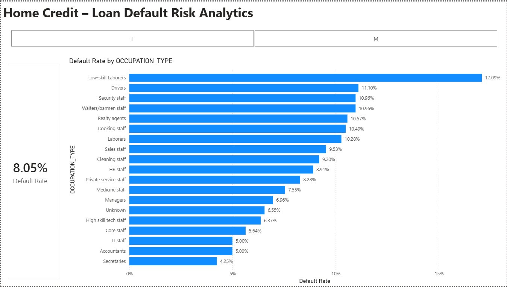
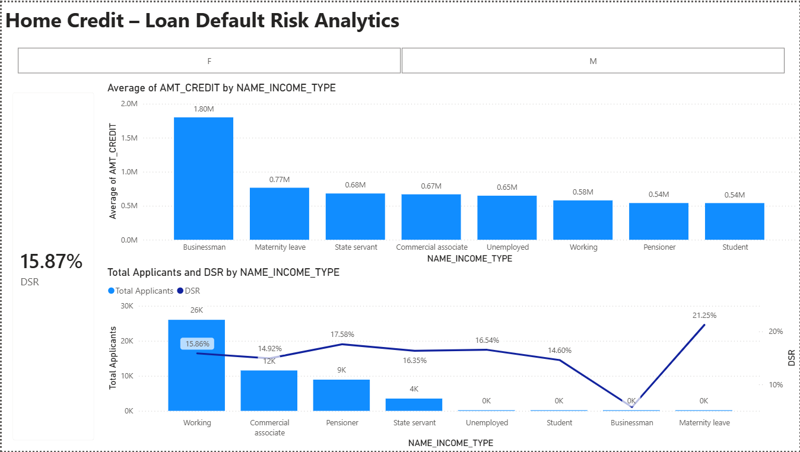

# 📈 Credit Risk Default Analytics (Home Credit)

## 🖥️ Dashboard Preview

### Page 1: Demographic Risk Overview

### Page 2: Financial Risk Deep-Dive

---

## 📌 Business Overview & Problem Statement (STAR: Situation & Task)
In the consumer finance industry, accurately assessing credit risk is crucial to minimizing **Non-Performing Loans (NPL)** while maximizing loan approval rates for qualified customers. 

Predicting customer default risk is a familiar challenge from my corporate experience at **PT Bussan Auto Finance (BAF)**. In this project, using the Home Credit dataset, the goal is to analyze historical application data to identify patterns of default risk, optimize the credit evaluation process, and ensure data-backed underwriting decisions.

---

## 🛠️ Project Architecture & Tech Stack
* **Data Source:** Home Credit Default Risk Dataset
* **Data Engineering & Backend Prep:** SQL (Production-ready querying, aggregation, and structural profiling)
* **Data Modeling:** Power BI (Star Schema implementation mapping application fact histories)
* **Business Intelligence & Analytics:** Microsoft Power BI (PL-300 Corporate Standard)

---

## 🏃‍♂️ Analytics Walkthrough (STAR: Action)

### 1. Data Cleaning & Structured Pipeline
All raw metadata references are stored in the `/data` folder. Production-grade data transformations and structural risk queries are systematically documented in the `/sql_queries` directory to ensure reproducible analytics.

### 2. Data Modeling (Star Schema)
To ensure optimal query performance and matrix calculations in Power BI, the architecture is structured into a clean Star Schema, separating the primary application profiles (Fact Table) from measure-grouping containers.

### 3. Key Metrics & DAX Calculations
The analytics dashboard monitors critical credit risk metrics engineered via advanced DAX formulas:

* **Default Rate (%):** Calculates the percentage of dynamic payment difficulties across segments.
  $$\text{Default Rate} = \text{DIVIDE}(\text{COUNT}(\text{TARGET} = 1), \text{COUNT}(\text{TARGET}), 0)$$

* **Debt Service Ratio (DSR):** Measures applicant financial leverage by evaluating monthly obligation against total income.
  $$\text{DSR} = \text{DIVIDE}(\text{AVERAGE}(\text{AMT\_ANNUITY}), \text{AVERAGE}(\text{AMT\_INCOME\_TOTAL}), 0)$$

---

## 📊 Business Insights & Results (STAR: Result)

Based on the interactive dashboard deployment, the credit risk portfolio exhibits clear structural patterns across demographic and financial leverage factors:

### 🏢 1. Structural Labor & Demographic Risk Profile (Page 1)
* **Macro Portfolio Health:** The baseline portfolio exhibits a dynamic **8.05% Overall Default Rate**.
* **High-Risk Labor Segments:** High-volume operational occupations show massive risk concentrations. **Low-skill Laborers** present an alarming default rate of **17.09%**, followed by **Drivers** at **11.10%**, and **Security Staff** at **10.96%**.
* **Gender-Specific Risk Surge:** When isolated to **Male Applicants**, the overall default rate surges to **10.26%**. Most notably, **Male Realty Agents** exhibit an extreme default rate of **28.57%**, making it the highest risk category in the entire portfolio.
* **Underwriting Strategy:** Implement a high-barrier credit scoring tier for manual labor categories, shorten maximum loan tenures for high-default profiles, and apply stricter verification protocols for male applicants on high-commission real estate structures.

### 💸 2. Financial Leverage & Debt Service Ratio (DSR) Deep-Dive (Page 2)
* **Macro Financial Stress:** The average portfolio operates at a safe Debt Service Ratio (DSR), showing robust repayment breathing room.
* **Unemployed Segment Leverage:** Applicants flagged under the **Unemployed (Male)** segment show a critical cash-flow strain with an average DSR skyrocketing to **85.37%**, despite being assigned a minimal credit limit. This signals a guaranteed delinquency pipeline.
* **Data Quality Issue Discovered:** The dashboard exposed a data anomaly where male applicants were categorized under **Maternity Leave** with an average credit exposure of **0.77M** and a high DSR of **21.25%**. 
* **Risk Mitigation Strategy:** Establish a hard systemic cap on maximum allowable DSR (e.g., maximum 30% for standard applicants). Automatically route any "Unemployed" high-DSR profiles to an immediate auto-reject pipeline. Initiate a data-cleansing sweep with the IT core banking system to eliminate cross-gender data entry errors found in the Maternity Leave category.

---

## 📂 Repository Structure
* `dashboards/`: Contains the interactive Power BI `.pbix` file and static preview components.
* `data/`: Contains dataset columns descriptions and source references.
* `sql_queries/`: Contains production-ready SQL scripts used for data preprocessing and profiling.
* `reports/`: Contains executive summary reports and business insights converted to PDF format.
